# Governor MVP v0.1 — 模块设计说明

> **项目**: PKIA L2 Memory OS  
> **版本**: MVP v0.1  
> **架构策略**: Slot Index Strategy A  
> **前置文档**: memory_ontology_v1.1.md · memory_schema_v1.0.md · mcp_capability_audit.md

---

## 包结构

```
pkia_memory/
├── __init__.py          # 包声明与架构摘要
├── models.py            # 核心数据类
├── slot_index.py        # Slot 内存索引
├── relation_index.py    # 关系内存索引
├── memory_service.py    # 启动加载 + MCP 命令构建
└── governor.py          # 治理引擎（入口）
```

**总代码量**: 1,279 行（含空行与注释）

---

## 1. models.py — 核心数据类

**职责**: 定义了 L2 Memory OS 的全部数据模型，不依赖其他内部模块。

### 类图

```
MemoryStatus (Enum): ACTIVE | DRAFT | DEPRECATED | ARCHIVED
SourceType  (Enum): USER_EXPLICIT | AGENT_INFERRED | SYSTEM_GENERATED
Category    (Enum): identity | preference | project | working

MemoryNode (dataclass)
  ├── node_id: str             # "mem_<uuid>"
  ├── category: str            # 四层之一
  ├── key: str                 # snake_case 记忆键
  ├── value: str               # 记忆值
  ├── context: str             # 上下文限定符（默认 ""）
  ├── status: MemoryStatus
  ├── confidence: float        # [0.0, 1.0]
  ├── source_type: SourceType
  ├── created_at: datetime
  ├── updated_at: datetime
  ├── expires_at: datetime|None
  ├── version: int             # 从 1 递增
  ├── reinforcement_count: int
  │
  ├── slot_id: str (property)          # "category:key@context"
  ├── is_active: bool (property)
  ├── is_draft: bool (property)
  ├── is_same_value_as(other) -> bool
  ├── from_observations(cls, node_id, observations) -> MemoryNode
  └── to_observations() -> list[str]

SlotInfo (dataclass)
  ├── slot_id: str
  ├── active_node_id: str|None
  ├── version_count: int
  ├── last_updated: datetime|None
  └── _node_ids: set[str]

RelationRecord (dataclass)
  ├── source_id: str           # from
  ├── target_id: str           # to
  └── relation_type: str       # "HAS_MEMORY" | "SUPERSEDED_BY" | ...

WriteRequest (dataclass)
  ├── category: str
  ├── key: str
  ├── value: str
  ├── context: str             # 默认 ""
  ├── source_type: SourceType  # 默认 USER_EXPLICIT
  ├── confidence: float        # 默认 1.0
  ├── expires_at: datetime|None
  └── slot_id: str (property)
```

### 关键设计决策

- **from_observations / to_observations**: 对称的序列化/反序列化接口，用于 JSON Lines ↔ MemoryNode 互转。所有字段以 `field_name: field_value` 格式存储为 observation 字符串。
- **slot_id 属性**: 由 category + key + context 动态拼接，无独立存储字段，确保一致性。
- **SlotInfo 的 _node_ids**: 维护 slot 内所有节点 ID 的集合，用于版本链遍历。不持久化，仅在内存中维护。

---

## 2. slot_index.py — Slot 内存索引

**职责**: 管理 `slot_id → SlotInfo` 的映射，提供 O(1) 的 ACTIVE 节点查找。

### 内部结构

```
SlotIndex
  ├── _slots: dict[str, SlotInfo]   # slot_id → slot 信息
  ├── _nodes: dict[str, MemoryNode] # node_id → 完整节点
  │
  ├── index_node(node)                    # 注册节点
  ├── get_node(node_id) -> MemoryNode|None
  ├── all_nodes() -> list[MemoryNode]
  │
  ├── get_slot(slot_id) -> SlotInfo|None
  ├── get_active(slot_id) -> MemoryNode|None    # ★ 核心读取方法
  ├── get_slot_nodes(slot_id) -> list[MemoryNode]  # 版本链
  ├── get_nodes_by_context(context) -> list[MemoryNode]
  ├── has_slot(slot_id) -> bool
  │
  ├── update_node_status(node_id, new_status)     # 状态变更
  ├── reinforce_node(node_id)                     # 强化更新
  │
  ├── slot_count, node_count (properties)
  └── list_slots() -> list[str]
```

### 关键设计决策

- **reinforce_node 的置信度公式**: 使用 Ontology v1.1 定义的公式 `confidence = 1 - (1 - initial)^count`。对于 USER_EXPLICIT（初始 1.0）的节点该公式是安全的恒等操作。
- **update_node_status**: 同时维护 SlotInfo.active_node_id 指针的更新，确保状态变更后 get_active 仍然正确。
- **get_nodes_by_context**: 遍历所有节点做 str 匹配。在小规模（<10k 节点）下可接受。大规模后需引入 context 倒排索引。

---

## 3. relation_index.py — 关系内存索引

**职责**: 管理所有关系记录的双向索引，弥补 MCP 不支持按类型/方向查询关系的缺陷。

### 内部结构

```
RelationIndex
  ├── _forward: dict[str, dict[str, list[str]]]
  │   # source_id → { relation_type → [target_id, ...] }
  │
  ├── _reverse: dict[str, dict[str, list[str]]]
  │   # target_id → { relation_type → [source_id, ...] }
  │
  ├── _all: list[RelationRecord]     # 全部关系记录（用于迭代）
  │
  ├── index_relation(record)
  ├── index_relations(records)
  │
  ├── get_targets(source_id, relation_type) -> list[str]   # 正向
  ├── get_sources(target_id, relation_type) -> list[str]   # 逆向
  ├── has_target(source_id, relation_type, target_id) -> bool
  │
  ├── get_relations_by_type(relation_type) -> list[RelationRecord]
  ├── get_relations_from(source_id) -> list[RelationRecord]
  │
  ├── trace_backward(node_id, max_depth=10) -> list[str]   # 版本链（旧）
  └── trace_forward(node_id, max_depth=10) -> list[str]    # 版本链（新）
```

### 关键设计决策

- **双向索引**: forward + reverse 两张表，支持从任意方向查询关系。这是对 MCP 缺失 `query_relations_by_type` 的补偿。
- **SUPERSEDED_BY 链追踪**: trace_backward 从最新版沿 SUPERSEDED_BY 追溯到最旧版；trace_forward 反向。假设链是单向的（无分叉），直接取第一个 target/source。

---

## 4. memory_service.py — 启动加载 + MCP 命令构建

**职责**: 两个正交功能：
1. 从 JSON Lines 文件解析出 MemoryNode 和 RelationRecord（启动阶段）
2. 将 Governor 的决策结果转换为 MCP 工具可执行的 payload 字典

### 函数清单

```
# 启动加载
load_json_lines(path) -> (list[MemoryNode], list[RelationRecord])
_parse_entity(obj) -> MemoryNode|None
_parse_relation(obj) -> RelationRecord|None
new_node_id() -> str   # "mem_<uuid4>"

# MCP 命令构建
build_create_entity(node) -> dict          # create_entities 参数
build_create_relations(relations) -> dict  # create_relations 参数
build_add_observations(node_id, obs) -> dict  # add_observations 参数

# 组合构建（供 Governor 调用）
build_create_result(node, relations) -> dict
build_supersede_result(new_node, old_node_id) -> dict
build_reinforce_result(node_id, count, updated_at) -> dict
```

### 关键设计决策

- **Governor 不直接调用 MCP**: 所有写入决策返回 `{"commands": [...]}`，由 Agent（Cline）通过 `use_mcp_tool` 执行。这保持了 Governor 的可测试性（不需要 MCP 服务器在线）。
- **JSON Lines 格式兼容**: 支持 MCP Memory Server 的标准 dump 格式（每行 `{"type":"entity"|"relation", ...}`）以及 `_meta` 前缀的扩展字段。
- **数据类型嗅探**: `_parse_entity` 先检查 entityType="MemoryNode"，再降级检查 observations 中是否包含 "category:" 和 "key:" 来兼容遗留数据。

---

## 5. governor.py — 治理引擎

**职责**: 顶层协调器。组合其他四个模块，提供 L2 Memory OS 的完整读写接口。

### 类图

```
Governor
  ├── slot_index: SlotIndex
  ├── relation_index: RelationIndex
  ├── _storage_path: str|None
  ├── _ready: bool
  │
  ├── startup(path)               # ★ 启动：加载 + 构建索引
  ├── is_ready (property)
  │
  ├── get_active(slot_id)         # ★ O(1) 读取
  ├── get_node(node_id)
  ├── get_slot_nodes(slot_id)
  ├── get_context_memory(context, tier_filter=None)
  ├── trace_memory(node_id, direction, max_depth)
  │
  ├── write(request)              # ★ 核心写入：决策树
  │   ├── _action_create()
  │   ├── _action_reinforce()
  │   └── _action_supersede()
  │
  ├── status() -> dict
  └── shutdown()
```

### 写入决策树

```
write(request)
  │
  ├── slot 无 ACTIVE? ──────────────────────→ W05: _action_create()
  │                                             返回 {"action": "created", ...}
  │
  └── slot 有 ACTIVE?
      │
      ├── value 相同? ──────────────────────→ W02: _action_reinforce()
      │                                         {"action": "reinforced", ...}
      │
      └── value 不同?
          │
          ├── C01: 旧=USER_EXPLICIT, 新=AGENT_INFERRED?
          │   └── 拒绝 → {"action": "rejected", ...}
          │
          ├── C01 reverse: 旧=AGENT_INFERRED, 新=USER_EXPLICIT?
          │   └── 允许 supersede
          │
          ├── C02: 旧.confidence > 新.confidence?
          │   └── 拒绝 → {"action": "rejected", ...}
          │
          └── 通过全部检查 → W04: _action_supersede()
                              {"action": "superseded", ...}
```

### 各 action 的 MCP 命令序列

| Action | MCP 命令数 | 序列 |
|--------|-----------|------|
| **created** | 2 | `create_entities`(新节点) → `create_relations`(HAS_MEMORY) |
| **reinforced** | 1 | `add_observations`(追加 count + timestamp) |
| **superseded** | 3 | `create_entities`(新节点) → `add_observations`(旧节点 → DEPRECATED) → `create_relations`(SUPERSEDED_BY + HAS_MEMORY) |
| **rejected** | 0 | 无操作 |

---

## 二、关键类图（Graphviz）

```dot
digraph PKIA_L2_Governor {
    rankdir=LR;
    node [shape=box, style=filled, fillcolor=lightyellow];

    subgraph cluster_models {
        label="models.py";
        style=filled;
        fillcolor=lightgrey;
        MemoryNode [label="{MemoryNode|node_id / category / key / value / context / status / confidence / source_type / version / reinforcement_count|+ slot_id + is_active + is_same_value_as() + from_observations() + to_observations()}"];
        SlotInfo [label="{SlotInfo|slot_id / active_node_id / version_count / last_updated}"];
        RelationRecord [label="{RelationRecord|source_id / target_id / relation_type}"];
        WriteRequest [label="{WriteRequest|category / key / value / context / source_type / confidence|+ slot_id}"];
    }

    subgraph cluster_slot {
        label="slot_index.py";
        SlotIndex [label="{SlotIndex|_slots: dict / _nodes: dict|+ index_node() + get_active() + get_slot_nodes() + reinforce_node() + update_node_status()}"];
    }

    subgraph cluster_relation {
        label="relation_index.py";
        RelationIndex [label="{RelationIndex|_forward / _reverse / _all|+ index_relation() + get_targets() + get_sources() + trace_backward() + trace_forward()}"];
    }

    subgraph cluster_svc {
        label="memory_service.py";
        Loader [label="{load_json_lines()|读取 JSON Lines → MemoryNode[] + RelationRecord[]}"];
        Builder [label="{MCP Command Builders|build_create_entity() / build_create_relations() / build_add_observations() / build_supersede_result()}"];
    }

    subgraph cluster_gov {
        label="governor.py";
        Governor [label="{Governor|+ startup() + get_active() + write() + get_context_memory() + trace_memory()}"];
    }

    // Dependencies
    SlotIndex -> MemoryNode;
    SlotIndex -> SlotInfo;
    RelationIndex -> RelationRecord;
    Governor -> SlotIndex;
    Governor -> RelationIndex;
    Governor -> Loader;
    Governor -> Builder;
    Builder -> MemoryNode;
    Builder -> RelationRecord;
    Loader -> MemoryNode;
    Loader -> RelationRecord;
}
```



---

## 三、数据流

### 启动流程

```
memory_service.load_json_lines("pkia-memory.json")
  │
  ├── 返回: (list[MemoryNode], list[RelationRecord])
  │
  ├── slot_index.index_node(node)  每个 MemoryNode
  │     └── 更新 _slots[slot_id] 和 _nodes[node_id]
  │
  └── relation_index.index_relations(records)
        └── 更新 _forward 和 _reverse 索引
```

### 读取流程

```
governor.get_active("preference:response_language@global")
  └── slot_index.get_active(slot_id)
        └── _slots[slot_id].active_node_id → _nodes[node_id]

governor.trace_memory("mem_v3", direction="backward")
  └── relation_index.trace_backward("mem_v3")
        └── 沿 SUPERSEDED_BY 链递归：mem_v3 → mem_v2 → mem_v1
  └── slot_index.get_node(nid) 获取每个节点的详情
```

### 写入流程

```
governor.write(request)
  │
  1. slot_index.get_active(slot_id)  → 检查冲突
  2. 决策: create / reinforce / supersede / reject
  3. 更新内存索引（先生效，保证后续读取一致）
  4. 构建 MCP 命令列表
  5. 返回 {"action": ..., "commands": [...]}
  │
  Agent 执行 commands 列表 → MCP Memory Server 持久化
```

---

## 四、未实现范围

| 功能 | 原因 | 后续实现 |
|------|------|---------|
| 生命周期定时任务（L01-L03） | 需要独立进程 | v0.2 |
| 数据一致性修复（D01-D04） | 启动时一次性检查 | v0.2 |
| 版本链超限裁剪 | 当前数据量小 | v0.2 |
| Memory Decay | 超出 MVP 范围 | v0.3 |
| Auto Archive | 超出 MVP 范围 | v0.3 |
| Semantic Retrieval | 超出 MVP 范围 | v0.4 |
| Multi-user | 超出 MVP 范围 | v0.5 |

---

## 五、文件清单

```
pkia_memory/
├── __init__.py          #    11 行  包声明
├── models.py            #   213 行  数据类
├── slot_index.py        #   180 行  Slot 索引
├── relation_index.py    #   162 行  关系索引
├── memory_service.py    #   292 行  加载 + 命令构建
├── governor.py          #   421 行  治理引擎
└── DESIGN.md            #   —       本文档
                        ────────
               总计:   1,279 行 + 文档